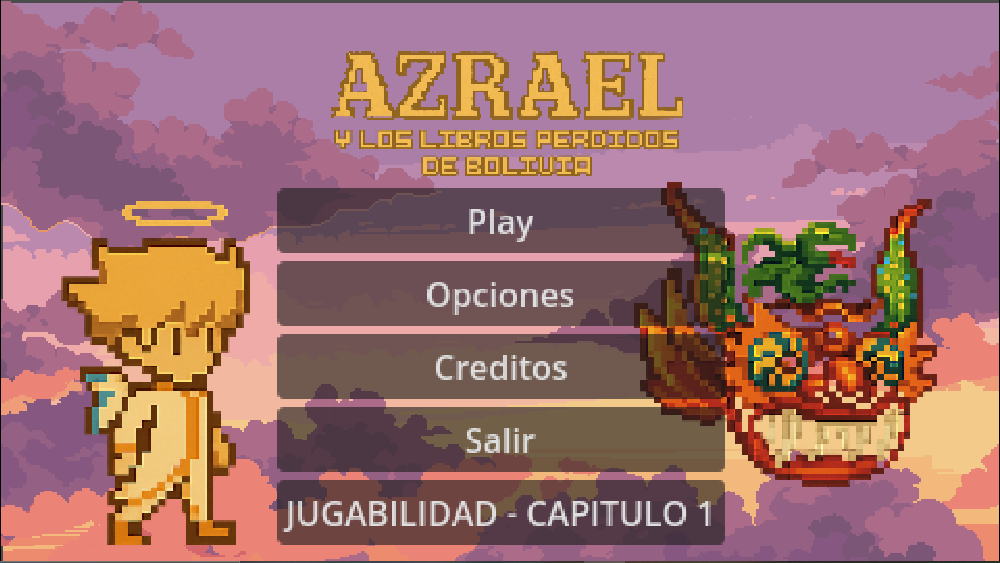
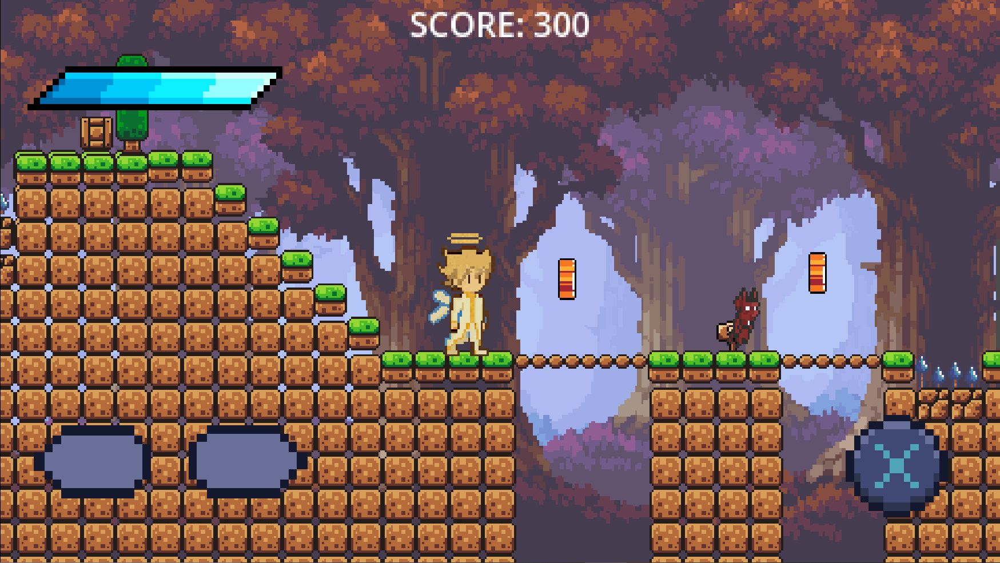
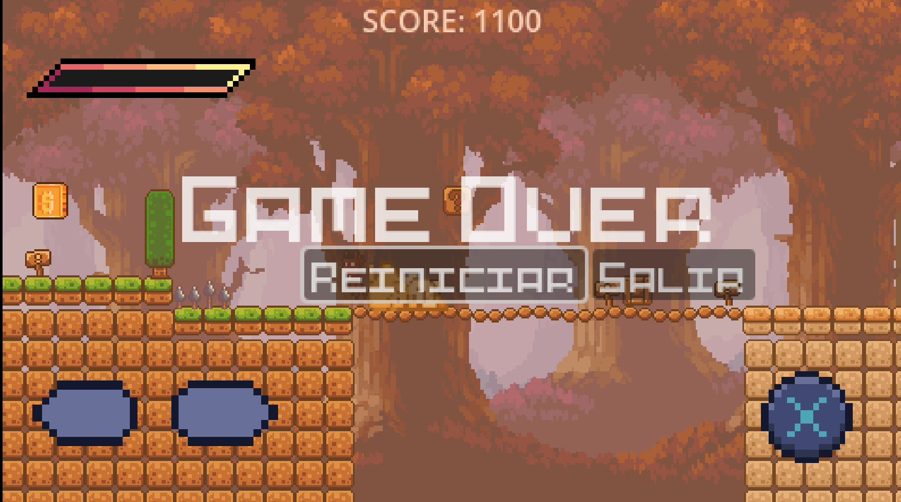

# 📚 Azrael y los Libros Perdidos de Bolivia

¡Bienvenido al emocionante mundo de **Azrael y los Libros Perdidos de Bolivia**!  
Un juego desarrollado con el motor **Godot**, que te llevará a recorrer escenarios mágicos inspirados en la historia y cultura boliviana.

---

## 🎮 Descripción del Juego

Azrael es un joven aventurero encargado de recuperar los libros sagrados del conocimiento boliviano, perdidos por el caos del tiempo.  
Cada libro representa una parte de nuestra historia, desde las civilizaciones precolombinas hasta el Bicentenario de Bolivia.
- <a href="https://yoi-tl.notion.site/INF281-El-Juego-1f6468052f8a80638189d6d00e5aefeb?source=copy_link">Documentacion completa del juego</a>
---

## 📸 Capturas de Pantalla

---

## 🕹️ Controles

- `Flechas / WASD`: Mover al personaje  
- `Espacio`: Saltar  

---

## 📦 Descargar

🎮 APK para Android:  
🔗 [Descargar Azrael (Google Drive)](https://drive.google.com/drive/folders/19kOGycvG_h8SR2lck4TIS3CzvLKW7_In?usp=drive_link)  

---

## 🛠️ Tecnologías Usadas

- [Godot Engine](https://godotengine.org/)  
- [Piskel](https://www.piskelapp.com/)
- Pixel Art  
- GDScript  
- Git + GitHub  
- Diseño narrativo educativo

---

## ✨ Características

- Historia original basada en Bolivia  
- Jugabilidad educativa y entretenida  
- Niveles con arte pixelado  
- Adaptado para PC y Android

---

## 📌 Estado del Proyecto

> ✅ Completado / 🚧 En desarrollo / 🧪 Prototipo

🚧 En desarrollo — Este juego aún está siendo mejorado y optimizado.  
¡Tus sugerencias y comentarios son bienvenidos!

---

## 🙌 Autor

👤 **Yoel Ticona**  
Estudiante de Informática - UMSA  
🎮 Apasionado por la programación, el arte y Bolivia.  
📧 Contacto: [yoelticona.dev@gmail.com](mailto:yoelticona.dev@gmail.com)

---

## 📜 Licencia

Este proyecto es de uso personal.

